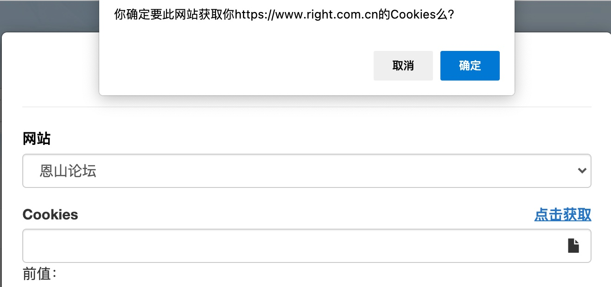
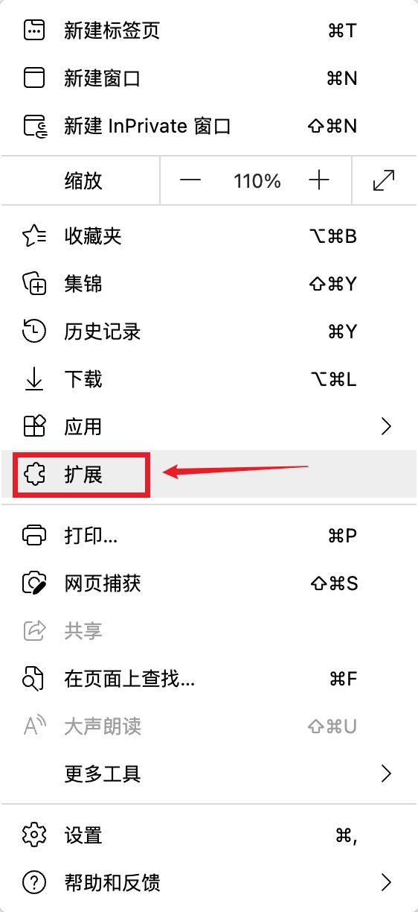
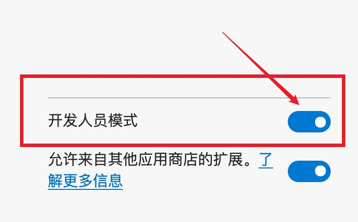
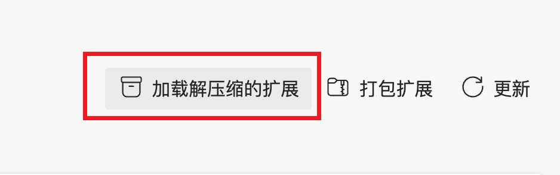
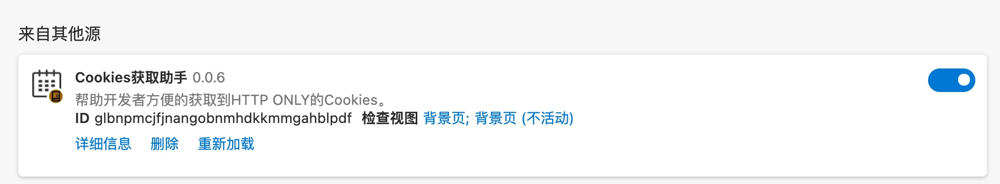

这个项目是 fork 过来的，如果你想看原来的 readme 文档，点击这里：[README-old.md](README-old.md)

### 这个插件的作用是什么呢？

它主要是用来获取网站的 cookie 的，可以搭配 [qiandao](https://github.com/qiandao-today/qiandao) 这个项目来使用，当我们搭建好 qiandao 后，可以通过浏览器来访问，然后本来是需要自己手动，打开开发者工具，去获取其它网站的 cookie，将它粘贴到 qiandao 里面的。

但是如果使用这个插件，我只需要点击一下，就可以自动获取 cookie 了，会方便很多，如下图。



那么接下来是安装教程，我这里使用 edge 来作为演示，使用 Chrome 也是可以的，我之前有尝试过。

----

## 安装教程



1、首先点击右上角的【扩展】



2、打开【开发人员模式】

3、下载插件

那么你可以选择 git clone 本项目到电脑

```
git clone https://github.com/powersee/GetCookies.git
```

有可以选择 【download zip】下载后解压，确保插件是已【文件夹】形式存放在你的电脑里的。

4、修改插件

使用文本编辑器（我用的是 vscode，用记事本或许也可以吧，没试过）打开 `manifest.json` 文件，里面的第 8 行是

```
http://qiandao.powersee.top/*
```

你要把它给为你自己的网址，如果你是把 qiandao 搭建在 vps 服务器之类的，你也有自己的域名，那就把网址改为自己的就行。

如果你是搭建在家里的，如果群晖、树莓派、 N1、玩客云、电视盒子之类的，那么一般只有一个局域网 ip 之类的，例如（192.168.1.22）

那么你可以改为这样

```
http://192.168.1.22/*
```

如果你的 vps 没有绑定域名，也可以将 vps 的 ip 填上去。

修改好后保存退出即可。



 5、点击【加载解压缩的扩展】，



6、插件会显示在【来自其他源】里面，确保后面的开关是打开的


7、之后刷新一下 qiandao 网页应该就能看到效果了。

## 其它

如果我有多个 qiandao 应用呢？

例如我自己就搭建了一个在国外的 vps 服务器上，并且家里的 nas 也有搭建，那么我就至少有两个网站需要适配了，应该怎么修改这个插件呢？

其实很简单，这样改就行

```
"matches": [ "http://qiandao.powersee.top/*", "http://qnap:9527/*"]
```
也就是 "第一个网址", "第二个网址" 

中间用英文的逗号 `,` 隔开就行，后面同样可以继续添加。 
